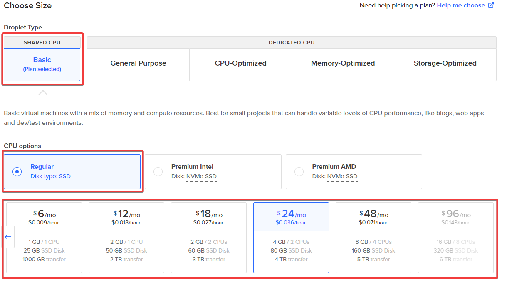
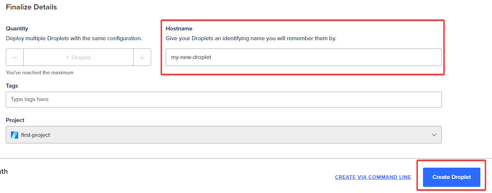
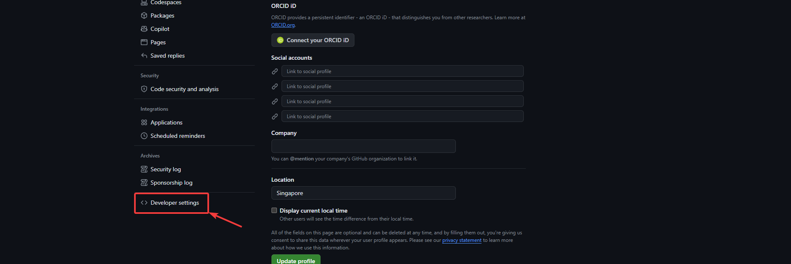

# go-cart.io deployment (Manual method)

## Create DigitalOcean droplet
Navigate to the "Create Droplet" page in the DigitalOcean UI


Select 'Singapore' as the region


Select the latest LTS Ubuntu image


Select "Basic" from "Droplet Type", then select "Regular" from "CPU options". Thereafter, select a VM spec that is appropriate. For this example, we chose the $24/month 4GB RAM 2 CPU spec.


Skip ahead to "Choose Authentication Method". Choose from either SSH Key authentication (recommended for security) or Password authentication. If you choose SSH Key authentication, you will need to specify the SSH keys you wish to allow to authenticate against the machine. If you do not have your own SSH keypair or wish to generate a new one, follow the instructions on-screen after clicking "New SSH Key"


Skip to "Finalize Details" and give your new droplet a hostname (e.g. cartogram-web). Then, click on "Create Droplet"


Click on your new droplet's IP address to copy it


### Updating DNS Records
You will need to use this IP address to update the A Record of your domain name, so that the website can be accessed from 'domainname.com' when everything is set up. Consult your domain registar's documentation as this can differ from registar to registar.

## Accessing the new droplet and configuring it
Launch a new terminal, or your favourite SSH application. This example will use the terminal.\
SSH Key Authentication: ```ssh -i path/to/private_key root@127.0.0.1```\
Password Authentication: ```ssh root@127.0.0.1```\
(replace 127.0.0.1 with the actual Droplet IP Address you copied)

### Install Docker
Run the following commands, as per the [Docker Documentation](https://docs.docker.com/engine/install/ubuntu/):
```
sudo apt-get update
sudo apt-get install ca-certificates curl
sudo install -m 0755 -d /etc/apt/keyrings
sudo curl -fsSL https://download.docker.com/linux/ubuntu/gpg -o /etc/apt/keyrings/docker.asc
sudo chmod a+r /etc/apt/keyrings/docker.asc

echo \
  "deb [arch=$(dpkg --print-architecture) signed-by=/etc/apt/keyrings/docker.asc] https://download.docker.com/linux/ubuntu \
  $(. /etc/os-release && echo "$VERSION_CODENAME") stable" | \
  sudo tee /etc/apt/sources.list.d/docker.list > /dev/null
sudo apt-get update

sudo apt-get install docker-ce docker-ce-cli containerd.io docker-buildx-plugin docker-compose-plugin
```

### Setting up cartogram-web
**Create cartogram UNIX user**\
```useradd -m -G docker -s /bin/bash cartogram```

**Log on as 'cartogram' user**\
```su cartogram```

**Clone cartogram-docker and cartogram-web**
```
git clone https://github.com/go-cart-io/cartogram-docker
cd cartogram-docker
git clone https://github.com/go-cart-io/cartogram-web
```

**Create the .env file**\
```cp .env.dist .env```

Edit the ```.env``` file and fill it in with the following details:
| Variable | Example Value | Remarks |
| -------- | ------------- | ------- |
| CARTOGRAM_SMTP_HOST | ```"smtp.mailgun.org"``` | SMTP server host name (Obtained from MailGun) |
| CARTOGRAM_SMTP_PORT | ```587``` | SMTP server port (Obtained from MailGun) |
| CARTOGRAM_SMTP_AUTHENTICATION_REQUIRED | ```"TRUE"```| Set to true when we require a username and password to send emails via MailGun |
| CARTOGRAM_SMTP_USER | ```"contactform@mg.go-cart.io"``` | Obtained from MailGun |
| CARTOGRAM_SMTP_PASSWORD | | Obtained from MailGun. If you are able to retrieve the existing password, a password reset can be avoided. |
| CARTOGRAM_SMTP_FROM_EMAIL | ```"contactform@mg.go-cart.io"``` | Email sender displayed on email sent from MailGun |
| CARTOGRAM_SMTP_DESTINATION | ```"support@go-cart.io"``` | Recipient of the email sent from MailGun |

**Obtaining MailGun details**


You will be able to copy the new mailgun password upon password reset at Step 6.


**Set PostgreSQL password**\
```cp password.txt.dist password.txt```

Edit passwords.txt with the PostgreSQL database password of your choice

**Start cartogram-web**\
```docker compose up -d```

### Setting up Nginx and Certbot (SSL Certificate)
**Ensure you are root user**\
If your username is 'cartogram', type:\
```exit```

**Install Nginx**\
```sudo apt install nginx```

**Install snapd**\
```sudo apt install snapd```

**Install certbot**\
```snap install --classic certbot```

**Generate SSL Certificate**
```
certbot certonly --webroot -w /var/www/html --email contact@go-cart.io -d go-cart.io --agree-tos --non-interactive
```
(replace ```contact@go-cart.io``` and ```go-cart.io``` with the respective domain and email)

**Setup certificate renewal cronjob**\
```sudo crontab -e```

Select your preferred CLI text editor (I recommend nano)
```
Select an editor.  To change later, run 'select-editor'.
  1. /bin/nano        <---- easiest
  2. /usr/bin/vim.basic
  3. /usr/bin/vim.tiny
  4. /bin/ed

Choose 1-4 [1]: 1
```

Insert the following at the end of the file and save it:\
```17 2 * * * certbot renew```

**Uploading Nginx config**\
Open a new terminal window on your **local machine** and use ```scp``` to transfer the template Nginx config
SSH Key Authentication: ```scp -i /path/to/private_key nginx.conf root@127.0.0.1:/etc/nginx/nginx.conf```\
Password Authentication: ```scp -i nginx.conf root@127.0.0.1:/etc/nginx/nginx.conf```\
(replace 127.0.0.1 with your droplet IP)

Edit the Nginx config file in ```/etc/nginx/nginx.conf```. Replace {{ domain_name }} with the domain name of the website (e.g. go-cart.io)

line 53 & 61: ```server_name {{ domain_name }};```\
line 63: ```ssl_certificate /etc/letsencrypt/live/{{ domain_name }}/fullchain.pem;```\
line 64: ```ssl_certificate_key /etc/letsencrypt/live/{{ domain_name }}/privkey.pem;```

Save the file and restart nginx:\
```sudo systemctl restart nginx```

### Setting up automated deployment
Make sure you are logged on as the ```cartogram``` user
```su cartogram```

**Automated deployment for cartogram-cpp**\
Create ```deploy-cartogram-cpp.sh``` in ```/home/cartogram``` with the following contents:
```
#!/bin/bash

# Download the latest cartogram binary release
wget -O /home/cartogram/cartogram-docker/cartogram-web/internal/lambda_package/cartogram https://github.com/{{ github_repo_username }}/cartogram-cpp/releases/latest/download/cartogram

# Give it execute permissions
chmod +x /home/cartogram/cartogram-docker/cartogram-web/internal/lambda_package/cartogram
```
Replace ```{{ github_repo_username }}``` with the GitHub username hosting the cartogram-cpp code

Grant the file execute permissions:\
```chmod +x /home/cartogram/deploy-cartogram-cpp.sh```

**Automated deployment for cartogram-web**\
Create ```deploy.sh``` in ```/home/cartogram``` with the following contents:
```
#!/bin/sh

cd /home/cartogram/cartogram-docker
git pull || exit 1
docker compose down
docker compose pull || exit 1
docker compose up -d || exit 1
```

Grant the file execute permissions:\
```chmod +x /home/cartogram/deploy.sh```

**Generate SSH Key for GitHub Actions**\
Execute the following command to generate a SSH Keypair for GitHub Actions to access the server to execute the 2 scripts we have created:
```ssh-keygen -f github -N ''```

**Generate GitHub Personal Access Token**
1. Go to the settings of your GitHub Account


2. Scroll down and click on "Developer Settings"

3. Click on "Personal access tokens" > "Tokens (classic)" > "Generate new token" > "Generate new token (classic)"

4. Give the token a memorable name. As this token will be used only for 1 time, the token can be set to expire any time you like. Grant the token the full "repo" access scope

5. Scroll down and click on "Generate token"

6. The token will be displayed on screen. Copy the token.


Place the token in a temporary file ```.token``` in ```/home/cartogram```

**Updating repository secrets**\
Run the following commands to update the repository secrets for ```cartogram-cpp```, ```cartogram-web``` and ```cartogram-docker```
```
cat github | ghupdatesecret {{ github_repo_username }}/cartogram-web DEPLOY_SSH_KEY -u {{ github_username }} -p `cat .token`
cat github | ghupdatesecret {{ github_repo_username }}/cartogram-docker DEPLOY_SSH_KEY -u {{ github_username }} -p `cat .token`
cat github | ghupdatesecret {{ github_repo_username }}/cartogram-cpp DEPLOY_SSH_KEY -u {{ github_username }} -p `cat .token`
```
(replace ```{{ github_repo_username }``` with the username hosting the respective repositories, and ```{{ github_username }}``` with your GitHub username)

**Install the public key into authorized_keys**
```
mkdir -p ~/.ssh && touch ~/.ssh/authorized_keys && chmod 600 ~/.ssh/authorized_keys && cat github.pub >> ~/.ssh/authorized_keys
```

**Clean up**\
Lastly, clean up the SSH keypair and your GitHub Access Token:\
```rm github github.pub .token```
