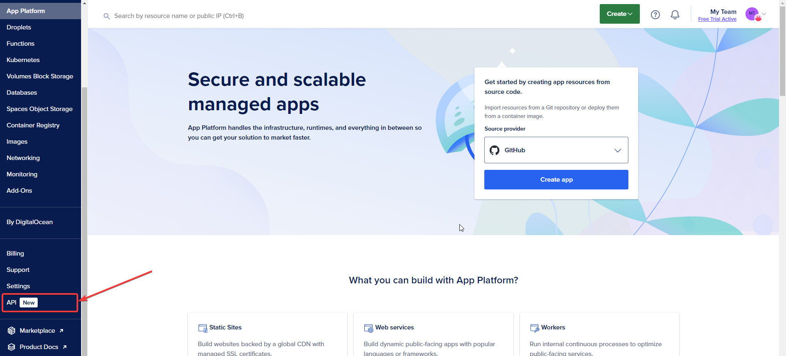
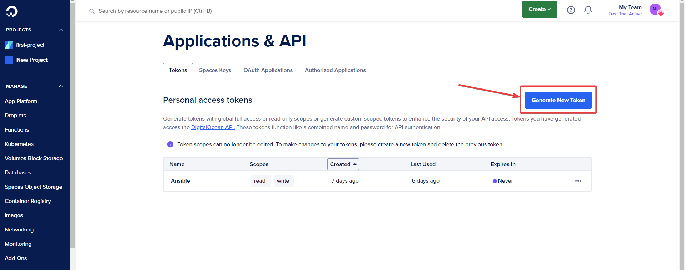
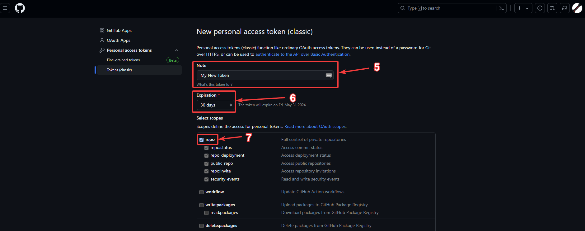
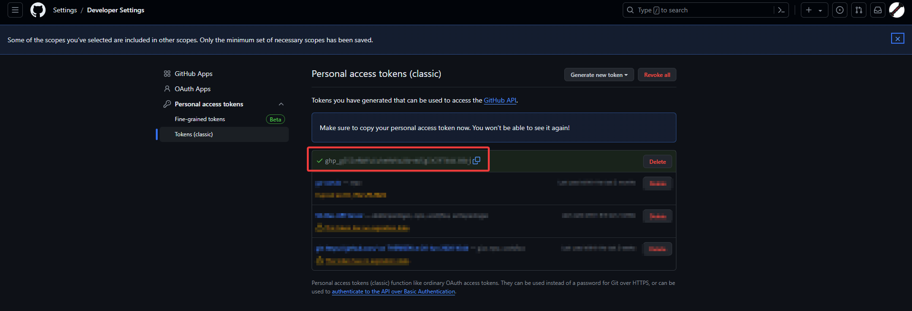

# go-cart.io deployment using Ansible

## Prerequisites
Ansible can only be run on UNIX-like machine with Python installed (e.g. Debian, Ubuntu, macOS). If you have a Windows environment, please install [WSL 2](https://learn.microsoft.com/en-us/windows/wsl/install) and execute the commands in the WSL 2 shell. The respository should already be cloned and commands will be executed in the repository directory.

### Install Ansible
You should have Python 3 and pip installed. Ubuntu and Ubuntu-based distro users should skip to [venv method](#venv-method)

To check if you have Python 3 installed. You might need to use the ```python``` command instead of ```python3```, subject to execution environment:\
```python3 -V```

To check if you have pip installed:\
```python3 -m pip -V```

If the requirements above are satisfied, we can install Ansible:\
```python3 -m pip install --user ansible```

Confirm that Ansible has been installed correctly:\
```ansible --version```

If you wish to upgrade the installed Ansible version in the future, run:\
```python3 -m pip install --upgrade --user ansible```

#### venv method
On certain Linux distros, you may see the following:
```
error: externally-managed-environment

× This environment is externally managed
╰─> To install Python packages system-wide, try apt install
    python3-xyz, where xyz is the package you are trying to
    install.
...(truncated)
```
In this case, you will need to use venv to install Ansible

Create and activate venv:
```
python3 -m venv venv
source venv/bin/activate
```

Install Ansible:\
```pip install ansible```

Confirm that Ansible has been installed correctly:\
```ansible --version```

If you wish to upgrade the installed Ansible version in the future, run:\
```pip install --upgrade --user ansible```

### Installing pre-requisite packages/collections
To install the Ansible collections required:\
```ansible-galaxy collection install -r requirements.yml```

The digitalocean Ansible collection requires additional Python libraries to run (documented [here](https://github.com/digitalocean/ansible-collection?tab=readme-ov-file#external-requirements)). You might need to check the documentation if the requirements have been updated and update ```requirements.txt``` accordingly.

To install the Python libraries required:\
```pip install -r requirements.txt```

### Setting DigitalOcean API key
First, create the .env file from the template\
```cp .env.dist .env```

Next, login to your DigitalOcean Account and go to the "API" page



Click on "Generate New Token"



Give the token a memorable name and choose a token expriation duration. You may set the token to never expire if you wish to.\
Grant the token "Full Access" and generate the token.


The token will now be displayed on screen.


Copy the token and replace the placeholder ```DO_API_KEY``` value in ```.env``` with the generated token.

Next, execute the following command to source the .env file so that the token can be accessible by Ansible\
```source .env```

## Deploying go-cart.io

### Configure Ansible variables
We can use the following website to determine the technical jargon of the DigitalOcean API to define the droplet specifications: https://slugs.do-api.dev/

| Website Term | Ansible Variable Value (digitalocean.yml) |
| ------------------ | ---------------------- |
| Regions | droplet_region |
| Droplet Sizes | droplet_size |
| Distro Images | droplet_image |

Below are a few examples of values and what it corresponds to:

**Regions**
| Value | Meaning   |
| ----- | --------- |
| sgp1  | Singapore, Datacenter 1 |
| sfo3  | San Francisco, Datacenter 3 |

**Droplet Sizes (Droplet hardware specifications)**
| Value | Meaning |
| ----- | ------- |
| s-2vcpu-4gb | Shared Regular CPU, 2 cores, 4GB RAM |
| s-4vcpu-8gb | Shared Regular CPU, 4 cores, 8GB RAM |
| s-2vcpu-4gb-120gb-intel | Shared Premium Intel CPU, 2 cores, 4GB RAM |
| s-4vcpu-8gb-amd | Shared Premium AMD CPU, 4 cores, 8GB RAM |

**Distro Images**
| Value | Meaning |
| ----- | ------- |
| ubuntu-24-04-x64 | Ubuntu 24.04 x64 |
| debian-12-x64 | Debian 12 x64 |

Now that we have determined how to spec our DigitalOcean droplet, we can set the following vars in ```playbooks/digitalocean.yml```
| Variable | Recommended Value | Remarks |
| -------- | ----------------- | ------- |
| droplet_size | ```s-4vcpu-8gb ```| |
| droplet_image | ```ubuntu-24-04-x64``` | Or whatever is the latest Ubuntu LTS |
| droplet_region | ```sgp1``` | |

This script will generate and save a SSH keypair for accessing the DigitalOcean droplet. You can change where the key is saved with the following vars:
- local_ssh_pub_key_path
- local_ssh_private_key_path

Alternatively if you wish to use your own existing SSH keypair, you can point these 2 variables to the location of your SSH public and private key.

Next, we will set up other variables that will be used to configure the go-cart.io application.

Run the following\
```cp playbooks/inventories/vars.yml.dist playbooks/inventories/vars.yml```\
to initialise the variables file.

Modify ```playbooks/inventories/vars.yml``` with the following details:
| Variable | Example Value | Remarks |
| -------- | ------------- | ------- |
| domain_name | ```"go-cart.io"``` | Domain name used for the web server |
| smtp_host | ```"smtp.mailgun.org"``` | SMTP server host name (Obtained from MailGun) |
| smtp_port | ```587``` | SMTP server port (Obtained from MailGun) |
| smtp_auth_required | ```"TRUE"```| Set to true when we require a username and password to send emails via MailGun |
| smtp_user | ```"contactform@mg.go-cart.io"``` | Obtained from MailGun |
| smtp_password | | Obtained from MailGun. If you are able to retrieve the existing password, a password reset can be avoided. |
| smtp_from_email | ```"contactform@mg.go-cart.io"``` | Email sender displayed on email sent from MailGun |
| smtp_destination | ```"support@go-cart.io"``` | Recipient of the email sent from MailGun |
| postgres_password | ```"password"``` | Password for the PostgreSQL Database. As a new PostgreSQL database is installed, this password is defined by the user executing this script |
| github_username | ```"go-cart-io"``` | GitHub username of user hosting the cartogram-web, cartogram-docker and cartogram-cpp repositories. If a GitHub organisation is used or a different users are hosting the repositories, override the next variable. This user must have write access to these repositories. |

**github_repositories**
```
github_repositories:
    - "{{ github_username }}/cartogram-web"
    - "{{ github_username }}/cartogram-docker"
    - "{{ github_username }}/cartogram-cpp"
```
Replace ```{{ github_username }}``` with the corresponding github_username if required (e.g. ```mgastner```)

**Obtaining MailGun details**


You will be able to copy the new mailgun password upon password reset at Step 6.

### Executing Ansible Playbook
With everything configured, we can now execute the deployment with\
```ansible-playbook playbooks/digitalocean.yml```

The execution will pause at certain stages where manual intervention is required.

1. You will need to manually update the domain DNS records with the newly deployed DigitalOcean droplet's IP Address. The message in the console will show ```Please update domain DNS records with IP Address:```. Press the 'Enter' key to continue execution once this is done.
2. You will need to generate a new GitHub personal access token to setup automated deployment.

**Generating GitHub personal access token**
1. Go to the settings of your GitHub Account


2. Scroll down and click on "Developer Settings"

3. Click on "Personal access tokens" > "Tokens (classic)" > "Generate new token" > "Generate new token (classic)"

4. Give the token a memorable name. As this token will be used only for 1 time, the token can be set to expire any time you like. Grant the token the full "repo" access scope

5. Scroll down and click on "Generate token"

6. The token will be displayed on screen. Copy the token.
